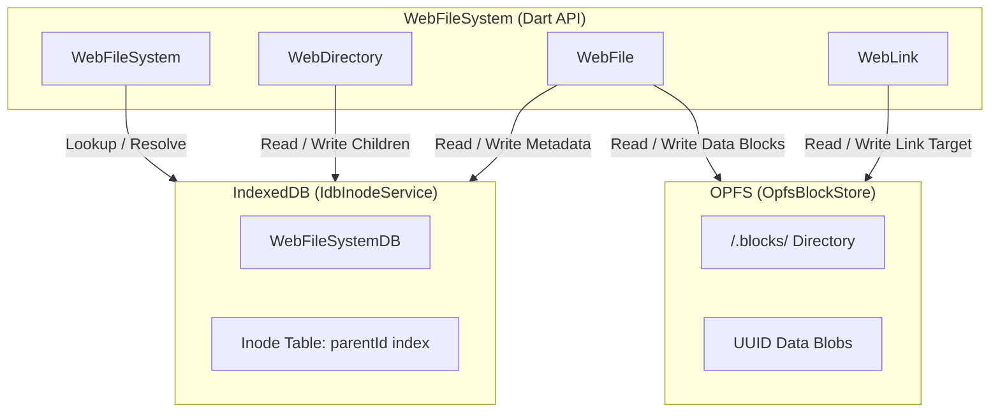

# web_file_system

A high-performance, fully asynchronous VFS (Virtual File System) for the web implementing Dart's standard `package:file` interfaces. 

It uses a hybrid backend that separates metadata management from actual block storage for optimal latency and performance in the browser.

---

## Key Features

* **`package:file` Compliance**: Drop-in replacement for standard file system operations. Fully compatible with libraries expecting a `FileSystem` interface.
* **O(1) Directory Renames**: By utilizing an inode-based database structure, directory renames and moves are fast constant-time operations. Children don't require path prefix updates.
* **IndexedDB Metadata Store**: Keeps directory hierarchies, timestamps, file sizes, and symbolic links indexed using fast IndexedDB tables.
* **OPFS (Origin Private File System) Block Store**: Stores raw file bytes and stream chunks directly in the high-performance private browser storage space.
* **Symbolic Links (Symlinks)**: Full support for relative and absolute symbolic links, target updating, recursive listing, and canonical path resolution.

---

## Architectural Flow



---

## Getting Started

### Installation

Add `web_file_system` to your `pubspec.yaml` (or reference the path if using as a path dependency):

```yaml
dependencies:
  web_file_system:
    path: path/to/web_file_system
```

---

## Usage Examples

### 1. Initializing the File System

```dart
import 'package:web_file_system/web_file_system.dart';

final fs = WebFileSystem();
```

### 2. Creating and Reading Files

```dart
final file = fs.file('/documents/report.txt');

// Standard write & read (creates parent directories if needed when recursive is true)
await file.create(recursive: true);
await file.writeAsString('Hello, Web private storage!');

final contents = await file.readAsString();
print(contents); // "Hello, Web private storage!"
```

### 3. Directory Listing & Traversal

```dart
final dir = fs.directory('/documents');
await for (final entity in dir.list(recursive: true, followLinks: false)) {
  print('${entity.path} (${entity.runtimeType})');
}
```

### 4. Symbolic Links

```dart
// Create a symbolic link
final link = fs.link('/shortcut_to_report');
await link.create('/documents/report.txt');

// Reading content through the link
final data = await fs.file('/shortcut_to_report').readAsString();

// Resolve canonical absolute path
final canonicalPath = await link.resolveSymbolicLinks(); 
print(canonicalPath); // "/documents/report.txt"
```

---

## Performance Notes: Inode vs Path-based Renames

Most browser file systems index files by their full path strings (e.g., keying a database table by `/documents/photos/holiday.png`). Renaming the directory `/documents` to `/archive` requires iterating over every nested path and rewriting their keys, which is an $O(N)$ operation where $N$ is the number of recursive items.

`web_file_system` implements an **inode index** model. Inodes reference parents by their database IDs rather than paths. Renaming a directory only updates the single directory node's `name` property. Its child files and directories remain untouched because they continue to reference the same unchanged parent inode ID. This makes directory renaming an **$O(1)$** operation.
