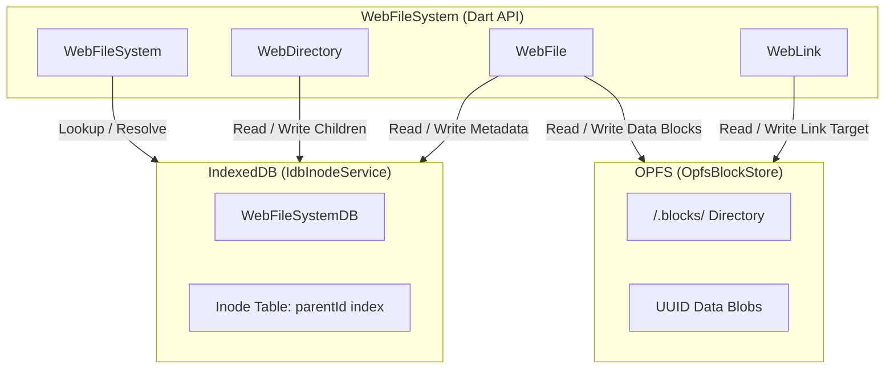

# web_file_system

A high-performance, fully asynchronous VFS (Virtual File System) for the web implementing Dart's standard `package:file` interfaces. 

It uses a hybrid backend that separates metadata management from actual block storage for optimal latency and performance in the browser.

---

## Key Features

* **`package:file` Compliance**: Drop-in replacement for standard file system operations. Fully compatible with libraries expecting a `FileSystem` interface.
* **O(1) Directory Renames**: By utilizing an inode-based database structure, directory renames and moves are fast constant-time operations. Children don't require path prefix updates.
* **IndexedDB Metadata Store**: Keeps directory hierarchies, timestamps, file sizes, and symbolic links indexed using fast IndexedDB tables.
* **OPFS (Origin Private File System) Block Store**: Stores raw file bytes and stream chunks directly in the high-performance private browser storage space.
* **Symbolic Links (Symlinks)**: Full support for relative and absolute symbolic links, target updating, recursive listing, and canonical path resolution.

---

## Architectural Flow



---

## Getting Started

### Installation

Add `web_file_system` to your `pubspec.yaml` (or reference the path if using as a path dependency):

```yaml
dependencies:
  web_file_system:
    path: path/to/web_file_system
```

---

## Usage Examples

### 1. Initializing the File System

```dart
import 'package:web_file_system/web_file_system.dart';

final fs = WebFileSystem();
```

### 2. Creating and Reading Files

```dart
final file = fs.file('/documents/report.txt');

// Standard write & read (creates parent directories if needed when recursive is true)
await file.create(recursive: true);
await file.writeAsString('Hello, Web private storage!');

final contents = await file.readAsString();
print(contents); // "Hello, Web private storage!"
```

### 3. Directory Listing & Traversal

```dart
final dir = fs.directory('/documents');
await for (final entity in dir.list(recursive: true, followLinks: false)) {
  print('${entity.path} (${entity.runtimeType})');
}
```

### 4. Symbolic Links

```dart
// Create a symbolic link
final link = fs.link('/shortcut_to_report');
await link.create('/documents/report.txt');

// Reading content through the link
final data = await fs.file('/shortcut_to_report').readAsString();

// Resolve canonical absolute path
final canonicalPath = await link.resolveSymbolicLinks(); 
print(canonicalPath); // "/documents/report.txt"
```

---

`web_file_system` implements an **inode index** model. Inodes reference parents by their database IDs rather than paths. Renaming a directory only updates the single directory node's `name` property. Its child files and directories remain untouched because they continue to reference the same unchanged parent inode ID. This makes directory renaming an **$O(1)$** operation.

---

## Synchronous API Support (Web Workers Only)

Because JavaScript and Dart run on a single-threaded event loop, blocking the main browser thread is not permitted. Therefore, standard synchronous APIs (such as `readAsBytesSync`, `writeAsBytesSync`, `existsSync`, `createSync`, `deleteSync`, `listSync`, `renameSync`, and `statSync`) will throw an `UnsupportedError` if invoked on the main application thread.

However, synchronous operations are **fully supported within Web Workers**. By delegating asynchronous work (IndexedDB metadata updates and Origin Private File System operations) to the main thread via a `SharedArrayBuffer` and blocking the Web Worker's execution loop using `Atomics.wait()`, you can safely use synchronous file system calls inside your workers.

### Prerequisites & Security Headers

To use the synchronous APIs, the browser requires cross-origin isolation. You must serve your web application with the following HTTP headers:

```http
Cross-Origin-Opener-Policy: same-origin
Cross-Origin-Embedder-Policy: require-corp
```

If these headers are not present, `SharedArrayBuffer` is disabled by the browser, and synchronous operations will throw a `StateError`.

### Setup Example

#### 1. Main Application Thread

Initialize the file system and register the worker proxy to listen to RPC requests from your worker:

```dart
import 'dart:html'; // or standard JS interop / package:web
import 'package:web_file_system/web_file_system.dart';

void main() {
  final fs = WebFileSystem();
  final worker = Worker('worker.js');
  
  // Register the proxy to handle synchronous RPC requests
  WebFileSystem.registerWorkerProxy(worker, fs);
}
```

#### 2. Web Worker Context (`worker.js` / Dart Worker)

In your worker code, once initialized with the `SharedArrayBuffer`, you can access the file system synchronously:

```dart
import 'package:web_file_system/web_file_system.dart';

void main() {
  final fs = WebFileSystem();
  
  // These operations block synchronous execution inside the Web Worker
  final file = fs.file('/data.bin');
  file.createSync();
  file.writeAsBytesSync([1, 2, 3, 4]);
  
  final bytes = file.readAsBytesSync();
  print(bytes); // [1, 2, 3, 4]
}
```

